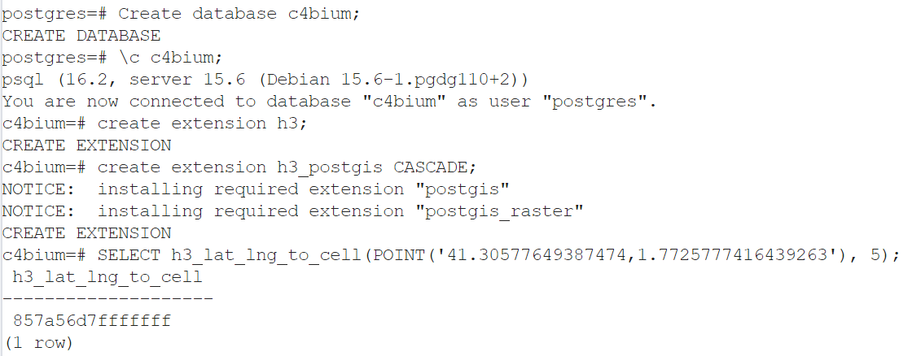

# Technical exercise @Cambium.earth 
## Author: Julien Collaer

Exercise from https://github.com/cambium-earth/gdd-test   
* Part 1. Setting up the infrastructure with Docker
* Part 2. Building a suitability analysis tool 
* Part 3. Additional questions

## Part 1, Infrastructure
To install/reproduce, first install git, pgAdmin or pgsql, an IDE and a docker and minikube.  
### Prepare and run postgres postgis h3 docker image
2 options are presented here the Dockerfile in postgish3 and the manual image from oficial postgis dockerhub postgis.
#### Option A

```
# After cloning this repo
cd postgish3
docker build -t postgish3 . 
docker run -d --name tpostgis-container -p 54321:5432 -e POSTGRES_PASSWORD=postgres tpostgish3
```
And the testing (see example above, by creating a db and testing a SQL script using h3)

#### Option B

Pull the official postGIS image from docker hub then run it:
```
docker pull postgis/postgis:15-master
docker run -it --name postgis-h3 -e POSTGRES_PASSWORD=postgres postgis/postgis:15-master
```

Conecting into postgres to install and configure extensions then cleanup image:
```
docker exec -it -u root postgis-h3 bash
apt update
apt install -y pip libpq-dev postgresql-server-dev-15
pip install pgxnclient cmake
pgxn install h3
pip uninstall pgxnclient cmake
apt purge -y libpq-dev postgresql-server-dev-15 pip
exit
```

Saving newly created docker image then running it:
```
docker commit postgis-h3 postgis-h3
docker stop postgis-h3
docker rm postgis-h3
docker run -it --name postgis-h3 -d  -p 5432:5432 -e POSTGRES_PASSWORD=postgres postgis-h3
```

To validate H3 installation a simple SQL could be tested against the newly installed postGIS using pgadmin or psql directly:
```
psql --version
psql 
Create database c4bium;
\c c4bium;
create extension h3;
create extension h3_postgis CASCADE;
SELECT h3_lat_lng_to_cell(POINT('41.30577649387474,1.7725777416439263'), 5);
```


## Running it on Kubernete
The chose option is using [minikube](https://minikube.sigs.k8s.io/docs/start/) local installation. So for that specific example we install then start a minikube locally:
```
minikube start
minikube addons enable dashboard
minikube addons enable ingress
```
To grant minikube the capacity to use local images, the images must be rebuilt using deamon 
# https://minikube.sigs.k8s.io/docs/handbook/pushing/#1-pushing-directly-to-the-in-cluster-docker-daemon-docker-env
```
& minikube -p minikube docker-env --shell powershell | Invoke-Expression
```
Then recreate the docker image including h3 locally. In a real kubernete env docker images can be deployed in image repositories.

The pgh3-*.yaml files contains the deployment and service definition can deploy and expose the postgis-h3 container previously created as a service:
```
kubectl apply -f minikube/pgh3-deploy.yaml
kubectl apply -f minikube/pgh3-srvc.yaml
```

Using the ip provided by *minikube ip* command, pgadmin can connect to the pgh3 deployed and validated.

# Part 2. Simple suitability analysis tool

Our business rules for Peltophorum dubium suitability are the following:
- landcover
    - not be forest neither wetland prior 5 years (March 2025 to March 2020)
- DEM
    - minimum slope of 1%, 
    - height above the nearest drainage >= 1 m

Per simplicity and time management this problem is solved in a simplified way 
in a python notebook from the area of interest.  
The notebook download and compute the data from diverse source, save geotiff 
in a data temporary folder and compute H3. 
Then a score is applied and some very simple statistics are shown.
Creation of a simple viewer with a rudimentary backend and storage into postgis h3 
database wasn't possible to be implemented after hours.
  

## Data ingestion:  

* Input data
  - Argentina interest area polygon
  - DEM raster file
  - height above drainage raster
  - landcover raster for years 2020, 2021, 2022, 2023, 2024, 2025

Python script in the notebook is working on the lowest h3 level possible for the interest polygon and computing the **bolean** following information: **is it suitable?**  
Suitable if : sloop > 1% and height >= 1 and each landcover 2020 to 2025 is different from wetlands or forests but of any other natural or uncovered area.  
Other aspects could be taken in account, protected area, buffer around roads and other human activities, ecological aspects, etc.  

See ingest.ipynb for details
3 categories are computed: 
 - score 0: not suitable
 - score 1: suitable
 - score 2 or 3: very good match (slope > 3perc or HAND > 3m)


## Part 3. Additional questions

The presented solution has been developed to be able to prepare it in just a few hours. For a production environement a deep and detailed study would be performed and a better architecture would be decided including functional and non functional elements.  
Storing data h3 in the backend postGIS for instance is probably the most basic and obvious change, but also the client and an API development between the backend and the frontend as a better catalog and data management pipelines to prepare regulary on demand or scheluded task or triggered by files changes.

The notebook is a scratchbook to demostrate some knowledge aroung GIS data, Python, raster file, H3 and data catalog.

A good architecture would download and store the data in a h3 dedicated database, query on demand and thourhg an API provide an
interactive map to visualize the data or a PDF print document.

1. What kind of aspects would you take into account if you were assigned with the task of implementing this type of analysis at scale?
   - Functional and user requirements.
   - Non-technical considerations such as availability, user volume, database selection, technologies, architecture, APIs, frameworks, and backend infrastructure for consistency.
   - Data update frequencies, scalability, and performance considerations.
   - Metadata management for understanding data update history and quality assurance.

2. How can you ensure that the output result is consistent over time and responds to the data quality business users expect?
   - Utilize user feedback mechanisms such as forms to gather input and ensure alignment with expectations.
   - Implement robust data governance defining data lifespan and triggers for recalculating datasets (e.g., annually, upon data source updates).

3. If one or more of the input data sources vary with time by their nature (e.g., land use change, deforestation, etc.), how would you approach this challenge? How can we compare the results of the analysis today vs a few months ago?
   - Incorporate a temporal dimension into spatial data, allowing for comparison via time sliders or split-screen views.
   - Develop case-specific reports with additional metrics or Key Performance Indicators (KPIs) for detailed analysis.
